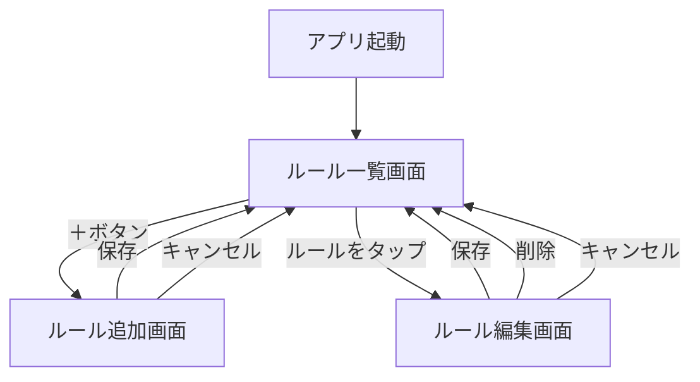

# アプリ仕様書（初期版）

## アプリ名（仮）
- SmartModeSwitcher 
  （自動マナーモード切替アプリ）

---

## 目的
ユーザーが設定した **時間帯** および将来的に追加する **位置情報** に基づき、  
スマートフォンのサウンドモードを自動で切り替える。

---

## 🧰 開発環境仕様（固定）

このアプリは以下の開発環境に準拠して構築・ビルドされます。  
すべてのコード出力・ビルド設定はこの仕様に従ってください。

- **JDK**: 17  
- **Android Gradle Plugin (AGP)**: 8.9.1  
- **Gradle**: 8.11.1  
- **Kotlin JVM Target**: 17  
- **compileSdkVersion**: 35  
- **targetSdkVersion**: 35  
- **minSdkVersion**: 28  
- **ビルドツールバージョン**: 自動（Android Studioにより管理）

#### 🔒 明示的なビルド設定例（`build.gradle`）

```kotlin
android {
    compileSdk = 35

    defaultConfig {
        minSdk = 28
        targetSdk = 35
    }

    compileOptions {
        sourceCompatibility = JavaVersion.VERSION_17
        targetCompatibility = JavaVersion.VERSION_17
    }

    kotlinOptions {
        jvmTarget = "17"
    }
}
```

> ✅ この設定はAIがコード生成する際にも必ず前提としてください。

---

## 機能要件

### フェーズ1（MVP）
1. **ルール作成**
   - 開始時刻・終了時刻を設定
   - マナーモード / 通常モード / バイブレーション を選択
   - ルールを有効/無効に切り替え可能  

2. **ルール一覧**
   - 複数ルールを登録可能（アラームのようなリスト表示）
   - ルールごとの編集 / 削除  

3. **自動切替処理**
   - 指定時間になるとマナーモードに切り替え
   - 終了時刻になったら通常モードに戻す  

4. **位置情報（ダミー対応）**
   - DB上はルールに `latitude / longitude / radius` を持つ  
   - フェーズ1では未使用（常に null or デフォルト値）

---

### フェーズ2以降の拡張（ロードマップ）
- フェーズ2：位置情報の入力欄をUIに追加（Google Maps / 住所入力）
- フェーズ3：Geofence API により「場所による切替」を有効化
- フェーズ4：時間帯 × 位置情報の複合条件をサポート

---

## データ仕様

### Rule エンティティ

@Entity(tableName = "rules")
data class Rule(
    @PrimaryKey(autoGenerate = true) val id: Int = 0,
    val enabled: Boolean = true,     // ルールON/OFF
    val startTime: String,           // "HH:mm"
    val endTime: String,             // "HH:mm"
    val latitude: Double? = null,    // ダミー（将来使用）
    val longitude: Double? = null,   // ダミー（将来使用）
    val radius: Int? = null,         // ダミー（将来使用, 単位m）
    val mode: Int                    // NORMAL=1, VIBRATE=2, SILENT=3
)

## UI仕様

### ルール一覧画面
- ルールをカード/リストで表示（RecyclerView）
- 各ルールの有効/無効スイッチ
- 編集 / 削除ボタン

### ルール追加/編集画面
- 開始時刻・終了時刻の入力（TimePicker）
- モード選択（ラジオボタン or ドロップダウン）
- **位置情報の入力欄（緯度・経度・半径、任意・空欄可）** ← フェーズ2で有効化
- 保存ボタン / キャンセルボタン

ChatGPT:

了解しました ✅
現状の MVP版（フェーズ1） を対象にした画面遷移図を Markdown 形式で追記します。
位置情報関連は ダミーとしてプレースホルダー表示のみ にしています。

## 📱 画面遷移図（フェーズ1 MVP）



---

## 非機能要件

- バッテリー効率を考慮し、時間帯判定は AlarmManager / WorkManager を利用
- マナーモード制御には Notification Policy Access 権限 をユーザーに許可してもらう必要あり
- 位置情報利用時には 位置情報権限 を追加要求（フェーズ2以降）

---

## 想定される使用例
- 平日9:00〜18:00 → マナーモード（会社用ルール）
- 土曜10:00〜12:00 → サイレント（勉強用ルール）
- 将来：図書館の位置を指定して → マナーモード（位置条件）

---

## 開発順序（ガイドライン）

1.プロジェクト環境構築
- Gradle, SDK 設定
- 必要ライブラリ導入（Room, Lifecycle, WorkManager）

2. データ層の実装
- Rule エンティティ定義
- DAO, Repository の作成
- Room データベース構築

3.UI層（ルール管理）
- ルール一覧画面（RecyclerView）
- ルール追加/編集画面（TimePicker, モード選択）
- DB とのバインド（LiveData / Flow）

4.ビジネスロジック層
- AlarmManager / WorkManager による時間トリガー処理
- AudioManager を用いたモード切替実装
- Notification Policy Access 権限要求処理

5.テスト & 調整
- DAO/Repository の単体テスト
- モード切替処理のテスト
- UI動作確認、バッテリー挙動の検証

6.拡張準備（将来フェーズ向け）
- 位置情報フィールドを保持（既にダミー有効）
- UIに位置情報項目を配置（プレースホルダーとして）
- Geofence API 導入のスタブコードやコメントを追加